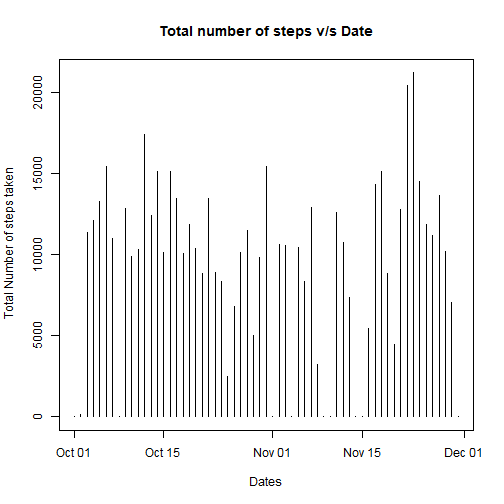
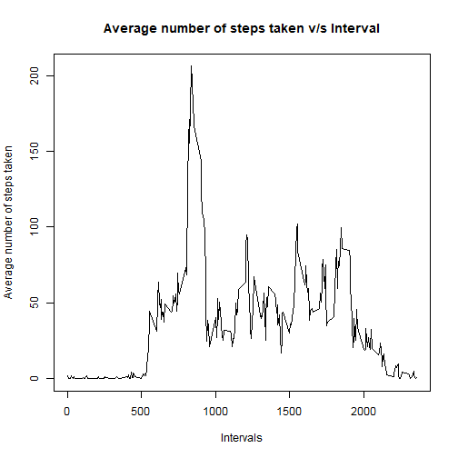
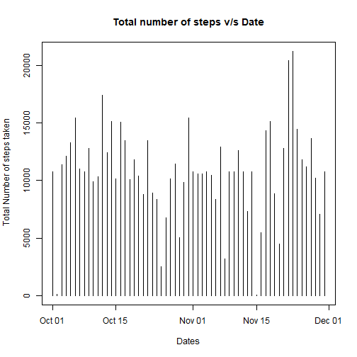
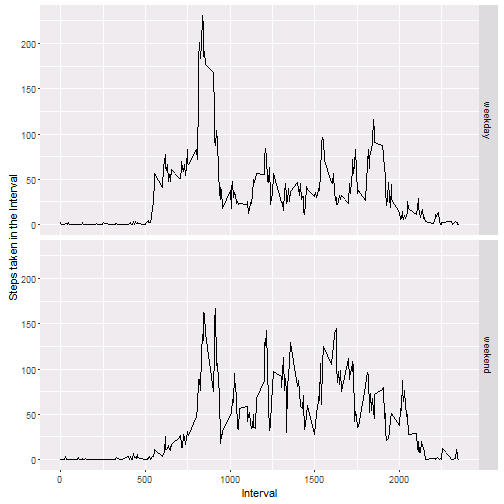

# Reproducible Research - Peer Graded Assignment: Course Project 1

## Purpose

This is a markdown document created for the purpose of saving the explanatory text and code being developed as part of first peer graded assignment for reproducible research course on one single document. It will contain the listing of the analysis performed on the activity data.

### Loading and preprocessing the data
The code below fetches the data file from the web if it is not already available in the current working directory. Post that it reads the data into 2 data frames.

```r
#Clearing up the environment
rm(list=ls())

#Import the ggplot library
library(ggplot2)
library(dplyr)

# Download the zip file and extract the 2 files from the Zip
if (!file.exists("activity.csv")) 
{
    download.file("https://d396qusza40orc.cloudfront.net/repdata%2Fdata%2Factivity.zip", destfile = "data_file" )
    unzip("data_file")
}

#Reading the data into R
data <- read.csv("activity.csv")
data$date <- as.Date(data$date)
```

### Aggregation of steps taken in a day and construction of plot
The code fragment below aggregates the data first by date. It then creates a plot of steps travelled in a day against all the days under consideration in the dataset. Post the consturction of the plot the mean and median values are also printed.

```r
grouped_data_by_day <- group_by(data, date)
final_day_summed_data <- summarise(grouped_data_by_day, steps_in_a_day = sum(steps , na.rm = T))

#Creation of the plot
plot(final_day_summed_data$date,final_day_summed_data$steps_in_a_day,type = "h" ,
     xlab = "Dates" , ylab = " Total Number of steps taken" , main = "Total number of steps v/s Date")
```



```r
#calculation of the mean and the median of the total number of steps taken per day
paste("The mean value of the number of steps travelled in a days is:"
      , round(mean(final_day_summed_data$steps_in_a_day , na.rm = TRUE),2),sep = " ")
```

```
## [1] "The mean value of the number of steps travelled in a days is: 9354.23"
```

```r
paste("The median value of the number of steps travelled in a days is:"
      , round(median(final_day_summed_data$steps_in_a_day , na.rm = TRUE),2),sep = " ")
```

```
## [1] "The median value of the number of steps travelled in a days is: 10395"
```
    
### Pre processing of data to calculate the average number of steps taken in each 5 minute interval across all days and creating the plot
The second part in the analysis pertains to the calculating the average number of steps taken (acros all days) in each of the 5 minute interval. The same has been plotted against all the intervals available in the data and the interval having maximum number of steps has been explicitly printed.


```r
#Grouping the data at the 5 minute interval level
grouped_data_by_interval <- group_by(data, interval)
final_interval_averaged_data <- summarise(grouped_data_by_interval, steps_in_an_interval = mean(steps , na.rm = T))

# Plotting for exercise 2
plot( final_interval_averaged_data$interval  , final_interval_averaged_data$steps_in_an_interval ,   type = "l" , 
      xlab = "Intervals" , ylab = "Average number of steps taken" , main = "Average number of steps taken v/s Interval" )
```



```r
paste("The interval which contains the maximum average number of steps travelled across all interval is :"
      ,final_interval_averaged_data[final_interval_averaged_data$steps_in_an_interval == max(final_interval_averaged_data$steps_in_an_interval),"interval"] , sep = " " )
```

```
## [1] "The interval which contains the maximum average number of steps travelled across all interval is : 835"
```

### Imputing missing values
This section deals with imputing the missing values.  The NA values have been filled with the mean value of the interval across all the days.


```r
int_data <- merge(data,final_interval_averaged_data, by = "interval" , all = FALSE )

for( i in 1:nrow(data)){
    
    if (is.na(int_data[i,2])){
        int_data[i,2] <- int_data[i,4]
    }
}

#Grouping the data at a day level
grouped_int_data_by_day <- group_by(int_data, date)
final_int_day_summed_data <- summarise(grouped_int_data_by_day, steps_in_a_day = sum(steps , na.rm = T))
```

The plot similar to the first one has been created but this time the NA values have been replaced with the mean values calculated in the same interval.


```r
#Creation of the plot
plot(final_int_day_summed_data$date,final_int_day_summed_data$steps_in_a_day,type = "h" ,
     xlab = "Dates" , ylab = " Total Number of steps taken" , main = "Total number of steps v/s Date")
```



```r
#calculation of the mean and the median of the total number of steps taken per day
paste("The mean value of the number of steps travelled in a days is:"
      , round(mean(final_int_day_summed_data$steps_in_a_day , na.rm = TRUE),2),sep = " ")
```

```
## [1] "The mean value of the number of steps travelled in a days is: 10766.19"
```

```r
paste("The median value of the number of steps travelled in a days is:"
      , round(median(final_int_day_summed_data$steps_in_a_day , na.rm = TRUE),2),sep = " ")
```

```
## [1] "The median value of the number of steps travelled in a days is: 10766.19"
```
From the above calculation, we can see that there is an increase in the value of mean number of steps travelled in a day because of filling up of the NA values. Also, the mean and the median values are coming out to be the same.

Also, a close observation of the charts formed before and after replacing the missing values will indicate to the fact that before the NA values were filled in, there were a few days with no data i.e. for all interlvals on those days, the graph showed no values. But after the replacement we will observe some readings on the graph appearing for those days too.

### Creating a plot of steps taken in each 5 minute interval and splitting it by Week/weekend days
For the last section of the assignment, I have plotted average number of the steps taken by each 5 minute interval but it has been split by weekend and weekdays. 
For reference, I have considered "Saturday" and "Sunday" as weekend days and others as Weekdays.


```r
#clasifying dates as weekend or weekdays

for ( i in 1:nrow(int_data )) {
  if( weekdays(int_data[i,3]) == "Saturday" | weekdays(int_data[i,3]) == "Sunday"){
      int_data[i,"day_type"] <- "weekend"
  }
      else {
      int_data[i,"day_type"] <- "weekday"
  } 
}
int_data <- transform(int_data, day_type = factor(day_type))

# Pre-processing of data before making the plot

grouped_int_data_by_day_type <- group_by(int_data, interval, day_type)
final_int_data_by_day_type <- summarise(grouped_int_data_by_day_type, steps_in_an_interval = mean(steps , na.rm = T))

#Constructing the plot
ggplot(final_int_data_by_day_type, aes(interval,steps_in_an_interval ) ) + geom_line() + facet_grid(day_type~.) + labs(x = "Interval" , y = "Steps taken in the Interval")
```



